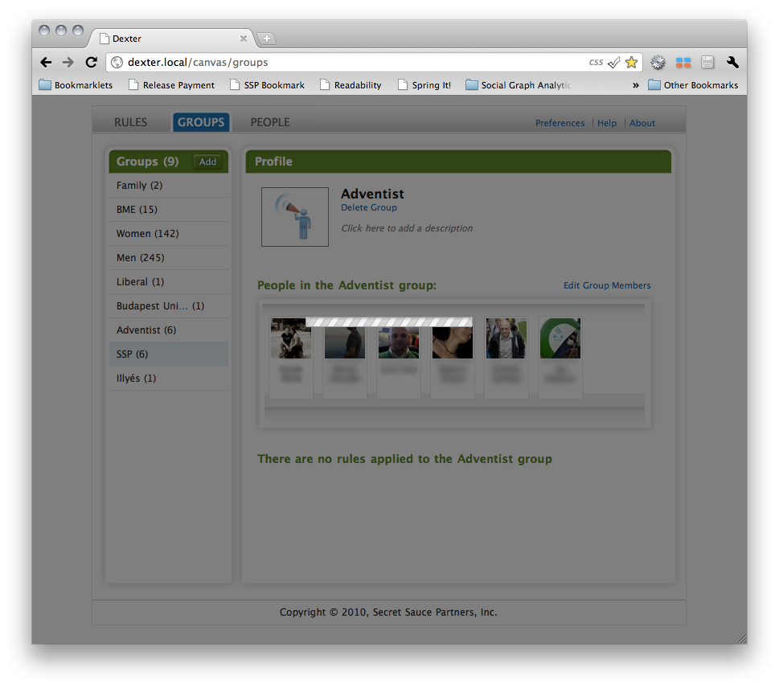

!SLIDE
# Ajax Loading Indicator

!SLIDE bullets incremental
## How to show some loading indicator without messing up all our code

* Solution: Global Ajax Event Handlers

!SLIDE

    @@@ javascript
    // Global AJAX loading indicator
    $(document).ajaxStart(function() {
      $('#loading').show();
    }).ajaxStop(function() {
      $('#loading').hide();
    });

!SLIDE bullets incremental
## Another issue:
## users clicking in stuff while we're loading

* Solution: `jquery.blockui.js`

!SLIDE

    @@@ javascript
    // Global AJAX loading indicator
    $(document).ajaxStart(function() {
     $.blockUI({
       css: { border: 'none', backgroundColor: 'transparent' },
       overlayCSS: { opacity: 0.5 },
       message: '</img>',
     });
    }).ajaxStop($.unblockUI);

!SLIDE center

